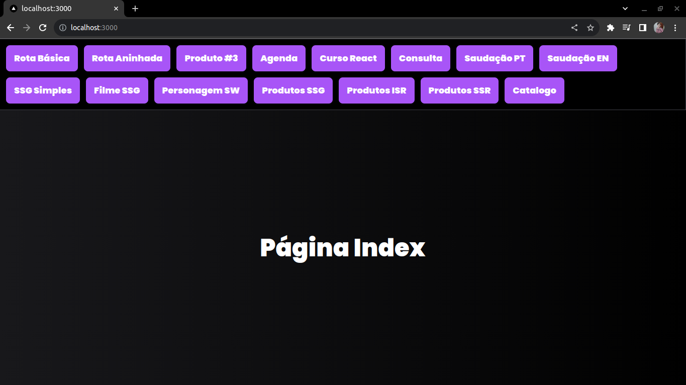

# Curso de Next.JS

<p align="center">
</img>
<!-- </img> -->
</p>

## 🤔 O que é este projeto

Este projeto foi desenvolvido para aprender como utilizar o Next.JS.

Este curso foi dividido em dois projetos feito com Next.JS, o curso vai focar em dois dos mais importantes recursos o Next.JS que é rotas e a parte de renderização, renderização do lado do cliente, renderização do lado do servidor e a geração estática de site.

Nesse primeiro projeto será voltado para pasta “pages” que foi pasta historicamente quem acompanhou Next.JS até agora e inclusive no futuro ainda a pasta pages será suportada.

No outro projeto vamos focar na pasta APP mostrando as diferenças das duas abordagens.

É necessário conhecimento prévio dos fundamentos de React.

Nas palavras do site do Next.JS:

“Next.JS são todas as ferramentas que você precisa para criar a Web. Mais rápido.”

“Next.js permite que você crie aplicativos Web full-stack, estendendo os recursos mais recentes do React e integrando poderosas ferramentas JavaScript baseadas em Rust para compilações mais rápidas.”

Este projeto faz parte do Módulo Especialista, na Trilha: React & Next, do curso Next.JS da Formação DEV.

## 🖥️ Como rodar este projeto

O projeto foi criado via terminal, inicialmente escolha onde a pasta do projeto será criada então direcione o seu terminal até lá para criar o projeto usando-pages com Next.JS pelo comando: <code>npx create-next-appeact-app@lastest usando-pages</code>.

Em seguida vai abrir a congufiguração do projeto escolha "yes" para as seguntes opções: TypeScrip, ESlint, Tailwind CSS, 'src/'. E "no" para App Router e import alias.

Entre na pasta do projeto criado.

A partir daqui você pode copiar as pastas e arquivos para dentro do projeto que foi criado.

Para rodar o projeto use o comando <code>npm rum dev</code> dentro da pasta do projeto.

## 🕹️ Como usar este projeto

Uma vez que a aplicação esteja rodando, você pode navegar clicando no menu da aplicação onde é demonstrado alguns exemplos de como o Next.JS funciona com as rotas e renderiza tanto do lado do cliente como do lado do servidor e a geração estática de site.

## ⚙️ Tecnologias usadas no projeto

- 
- 
- 
- 
- 
- 
- 

## 🗒️ Features do projeto

<!-- caracteristicas do projeto resumidas mas não é necessaria-->

- No menu do projeto demonstra com exemplos práticos como aprendemos rotas e renderização com Next.JS.

## 🗂️ Como este projeto está organizado

<!-- dar uma ideais geral não precisa ser detalhista -->

Na pasta raiz do projeto existe uma pasta src onde todos o projeto é organizado dentre eles destacamos:

- Pasta components-> contém os componentes da aplicação.
- Pasta pages -> contém outras duas sub-pasta que destacamos render e rotas que são responsáveis pela renderização e navegação.

## 👩‍💻 Como este projeto foi implementado

<!-- Aqui pode ser usado uma linguagem, mas técnica e não escrever demais-->

Este projeto foi implementado com HTML, CSS, JavaScript, TypeScript, TailwindCSS, React, todas essas tecnologias integradas pelo Next.JS.

Na pasta components especificamente criamos os componentes da aplicação.

Já pasta pages encontramos e destacamos duas outras sub-pasta a render e rotas.

Na sub-pasta render como o próprio nome diz renderizamos os componentes da aplicação.

Na sub-pasta rotas aprendemos sobre rotas básicas de rotas dinâmicas.

## ⭐ Dependências principais

<!-- API's importantes-->

Quando da criação do projeto com Next.JS na parte de configuração colocamos "yes" para as seguintes dependências: ESlint, Tailwind CSS.

## 🆘 Precisa de ajuda?

Você pode me contatar através desses contatos:

[](https://www.linkedin.com/in/marcelocmdev/)
[](marcelocmdev@gmail.com)
[](https://www.instagram.com/marcellocmedeiros/)
[](https://api.whatsapp.com/send?phone=5583999666768)

---

<center>

Feito com 🧑‍💻 por Marcelo no Curso Navegação com React.JS da [Formação DEV](https://escola.formacao.dev/)</center>

This is a [Next.js](https://nextjs.org/) project bootstrapped with [`create-next-app`](https://github.com/vercel/next.js/tree/canary/packages/create-next-app).

## Getting Started

First, run the development server:

```bash
npm run dev
# or
yarn dev
# or
pnpm dev
```

Open [http://localhost:3000](http://localhost:3000) with your browser to see the result.

You can start editing the page by modifying `pages/index.tsx`. The page auto-updates as you edit the file.

[API routes](https://nextjs.org/docs/api-routes/introduction) can be accessed on [http://localhost:3000/api/hello](http://localhost:3000/api/hello). This endpoint can be edited in `pages/api/hello.ts`.

The `pages/api` directory is mapped to `/api/*`. Files in this directory are treated as [API routes](https://nextjs.org/docs/api-routes/introduction) instead of React pages.

This project uses [`next/font`](https://nextjs.org/docs/basic-features/font-optimization) to automatically optimize and load Inter, a custom Google Font.

## Learn More

To learn more about Next.js, take a look at the following resources:

- [Next.js Documentation](https://nextjs.org/docs) - learn about Next.js features and API.
- [Learn Next.js](https://nextjs.org/learn) - an interactive Next.js tutorial.

You can check out [the Next.js GitHub repository](https://github.com/vercel/next.js/) - your feedback and contributions are welcome!

## Deploy on Vercel

The easiest way to deploy your Next.js app is to use the [Vercel Platform](https://vercel.com/new?utm_medium=default-template&filter=next.js&utm_source=create-next-app&utm_campaign=create-next-app-readme) from the creators of Next.js.

Check out our [Next.js deployment documentation](https://nextjs.org/docs/deployment) for more details.
